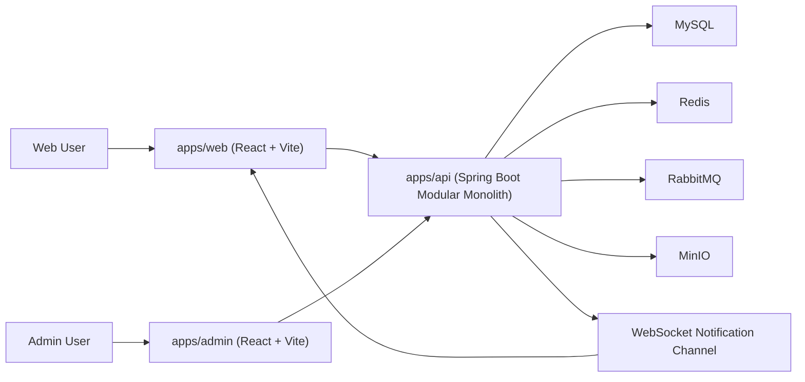
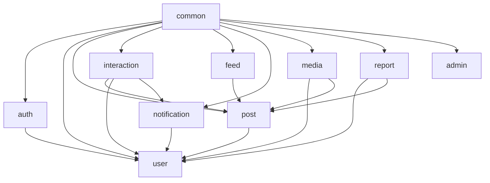
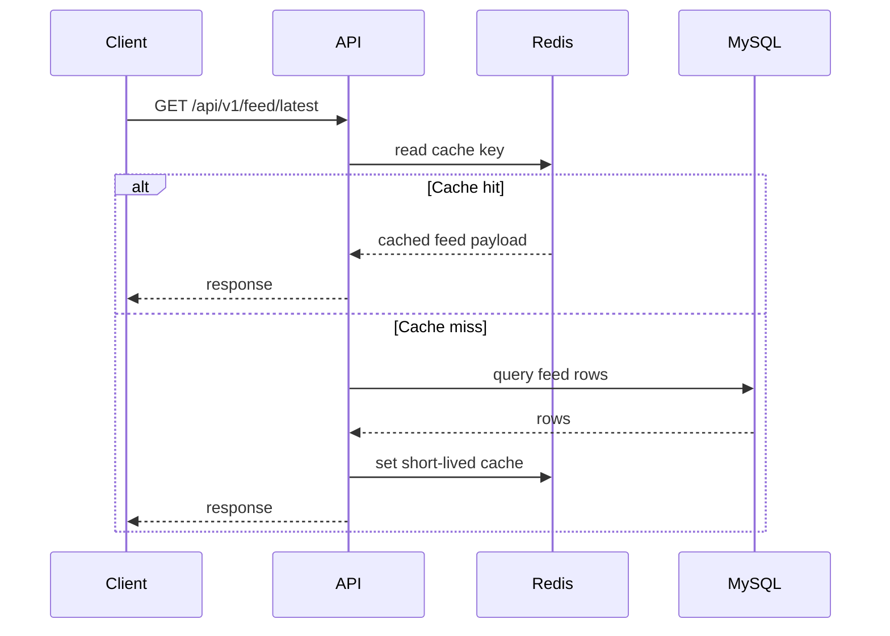
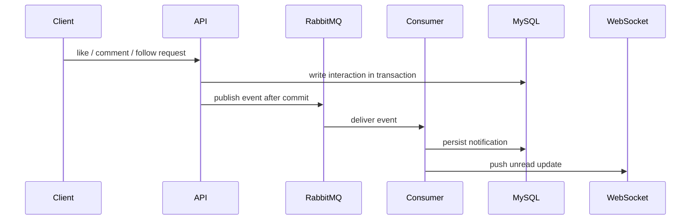
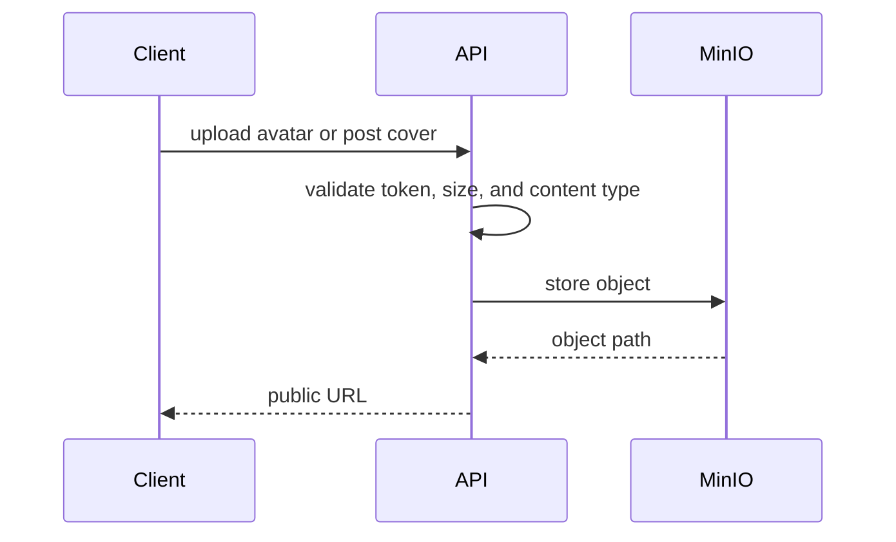

# Architecture Diagram

## System Context | 系统上下文

**EN**
The backend API is the central entry point. Redis reduces pressure on hot read paths, RabbitMQ decouples side effects, and MinIO stores user-uploaded media.

**中文**
后端 API 是系统核心入口。Redis 用于降低热点读路径压力，RabbitMQ 用于解耦副作用链路，MinIO 用于存储用户上传的媒体文件。

## Backend Module View | 后端模块视图

**EN**
The project uses a modular monolith to balance delivery speed, maintainability, and future service extraction.

**中文**
项目采用模块化单体架构，在交付效率、可维护性和未来拆分服务能力之间保持平衡。

## Feed Read Path | Feed 读取链路

## Notification Async Path | 通知异步链路

## Media Upload Path | 媒体上传链路

## 300k DAU Design Mindset | 面向 300k DAU 的设计思路
- Optimize read-heavy paths first
- Keep write path correct and simple
- Offload side effects with asynchronous processing
- Preserve clear module seams for future scale-out

- 优先优化读多写少的热点路径
- 保持写链路正确且足够简单
- 用异步处理卸载通知等副作用
- 保留清晰模块边界，便于后续扩展
