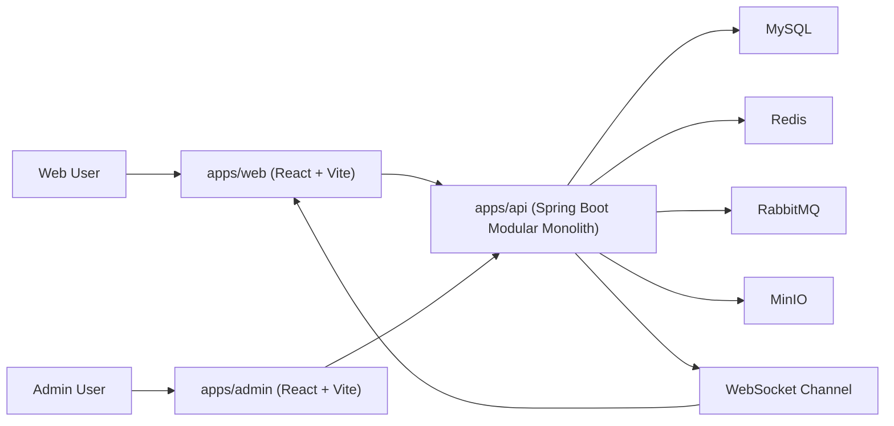
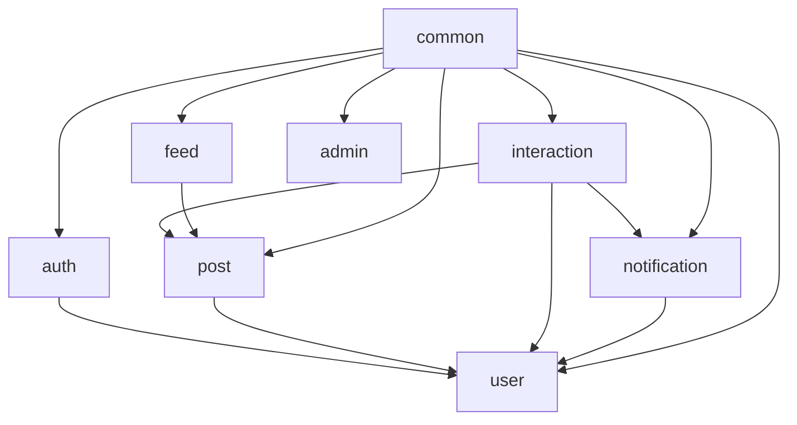
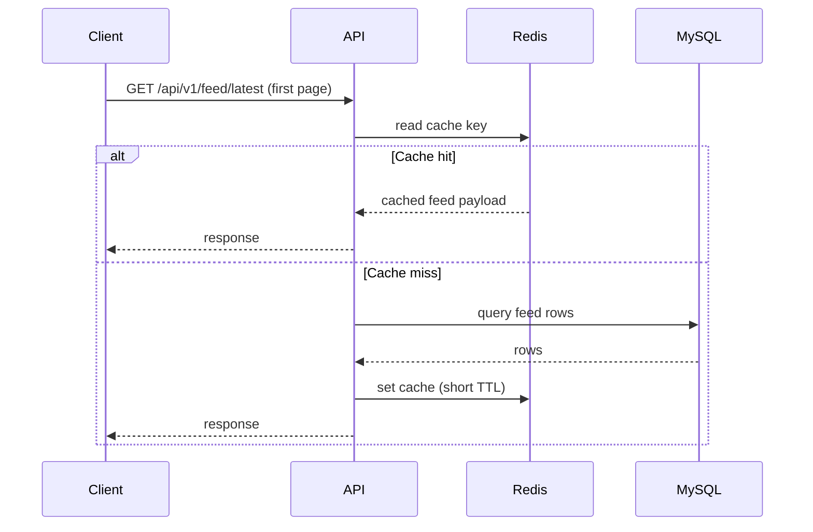
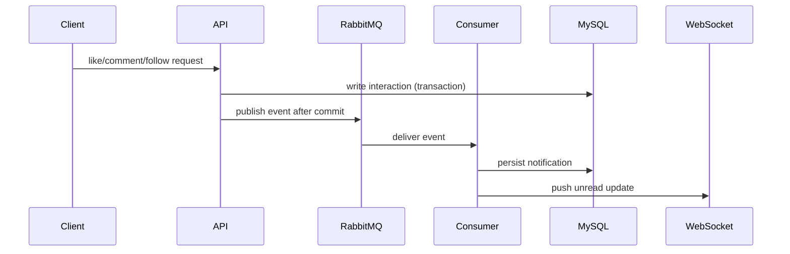

# Architecture Diagram | 架构图说明

## 1. System Context | 系统上下文

**EN**  
The API is the central backend entry, while Redis and RabbitMQ are used to optimize read latency and decouple asynchronous side effects.

**中文**  
API 是后端核心入口，Redis 用于降低高频读延迟，RabbitMQ 用于解耦异步副作用处理。

## 2. Backend Module View | 后端模块视图

**EN**  
The project keeps a modular monolith shape to balance delivery speed and future service-splitting readiness.

**中文**  
项目保持模块化单体形态，在交付效率与后续服务拆分之间取得平衡。

## 3. Feed Read Path (Cached) | Feed 读取链路（含缓存）

## 4. Notification Async Path | 通知异步链路

## 5. 300k DAU Design Mindset | 30 万 DAU 设计目标思路
**EN**
- Optimize read-heavy paths first
- Keep write path correctness and simplicity
- Use asynchronous processing for side effects
- Keep module seams clear for future scale-out

**中文**
- 优先优化读多写少链路  
- 保持写路径正确性与简洁性  
- 副作用通过异步处理解耦  
- 保持模块边界清晰，便于后续扩展  
